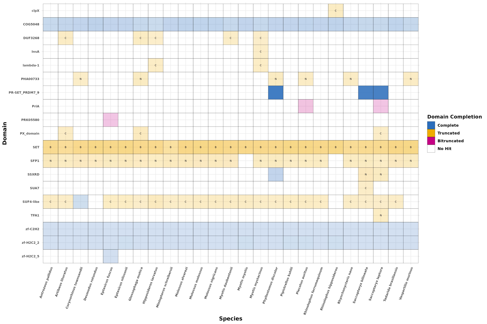
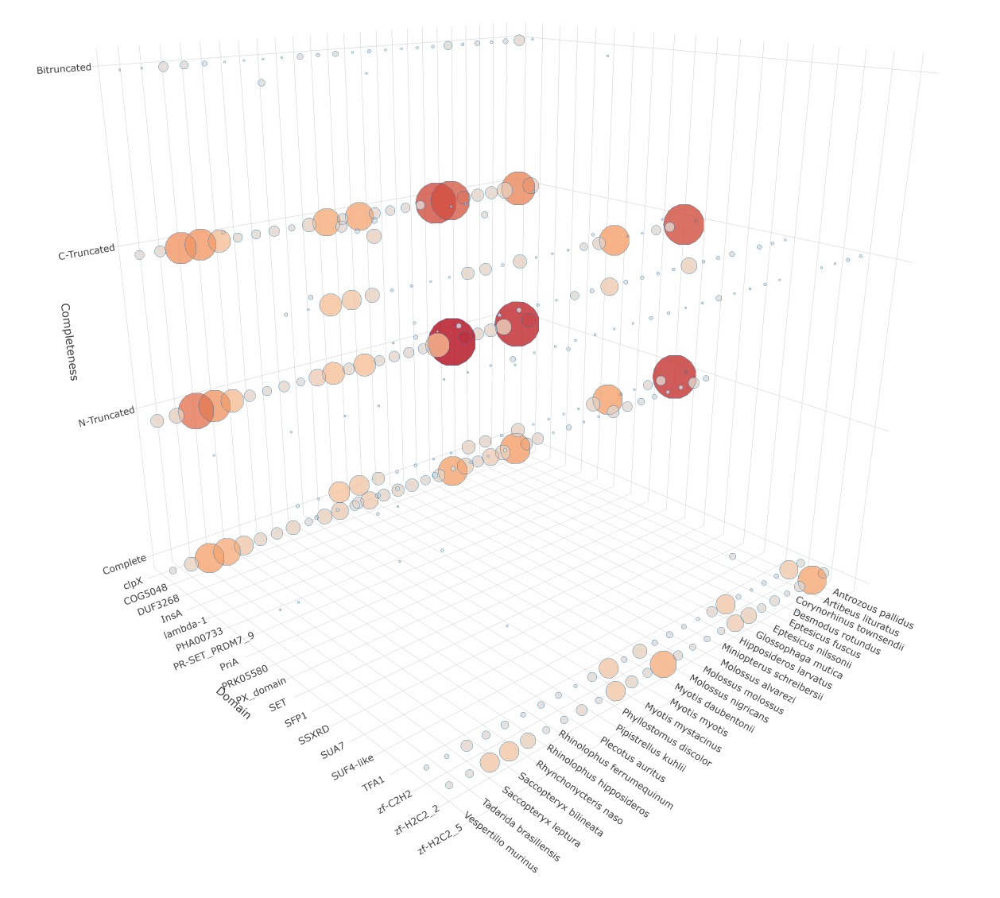

[](https://github.com/JorgeAndOmics?tab=repositories)
[](https://www.linkedin.com/in/jorge-gonzalez-garcia/)


[](images/logo.png)


# rpsHunter

**rpsHunter** is an object-oriented, fully parallelized computational pipeline for the detection, quantification, and classification of protein domains in user-specified genomes, based on protein-coding genes. Developed using the Snakemake workflow management system, rpsHunter prioritizes scalability, modularity, reproducibility, and fault tolerance, ensuring reliable and efficient domain annotation across diverse datasets.

**rpsHunter** automates the acquisition, validation, and indexing of reference genomes, streamlining database preparation. For domain discovery, rpsHunter employs a configurable homology-based search using the BLAST+ suite’s RPSBLAST tool in conjunction with the NCBI Conserved Domain Database (CDD). Results are further refined and interpreted through automated parsing and integration with HMM profile analyses. This combined approach enables sensitive and specific identification of protein domains, supporting robust cross-genome comparative analysis and confident domain assignment.

## Features

- **Seamless data acquisition** through automated genome downloads, robust database generation, and efficient serialized file management.

- **Flexible configuration** to accommodate a wide range of experimental protocols. Execute arbitrary Snakemake rules directly on your protein domain queries.

- **Comprehensive end-to-end automation** for protein-coding gene retrieval, homology-based domain detection, and structured result parsing.

- **Scalable execution** in any computing environment, leveraging Snakemake’s dynamic workflow orchestration for parallelized, high-throughput analyses.

- **Rich, structured logging** for transparent and auditable workflows.

- **Modular and extensible architecture** supporting straightforward integration, adaptation, and strict reproducibility.

- **User-friendly command-line interface** optimized for streamlined operation and minimal learning curve.

- **Extensive, well-annotated outputs** in standard formats including FASTA, GFF3, and comprehensive tabular reports.

- **Integrated, publication-quality reporting** featuring comprehensive, high-resolution visualizations for downstream analysis and communication.


## Technologies


## Installation

## Installation

To set up and run **rpsHunter**, follow these steps:

1. **Download rpsHunter**: Obtain the latest version from the [Releases](#) section.

2. **Install Dependencies**: rpsHunter requires the following tools installed on your host system:
   - [BLAST+ (version 2.12 or higher)](https://blast.ncbi.nlm.nih.gov/doc/blast-help/downloadblastdata.html)
   - [NCBI Datasets](https://www.ncbi.nlm.nih.gov/datasets/docs/v2/command-line-tools/download-and-install/)
   - [rpsbproc](https://ftp.ncbi.nih.gov/pub/mmdb/cdd/rpsbproc/RpsbProc-x64-linux.tar.gz) (NCBI's RPS-BLAST post-processing tool)

Furthermore, make sure to run `getcdddata.sh` within the rpsbproc tar.gz file to download the required accessory files for rpsbproc. Edit `db_root_folder` in the `config.yaml` file located in `data/config`. Create the following folders: `accessory/rpsbproc_annot1` within the specified `db_root_folder` path and uncompress the downloaded files within before executing the pipeline.

3. **Create Conda Environment**: After installing the dependencies, set up a new Conda environment using the provided `rpsHunter.yaml` file located in `data/config`:

   ```bash
   conda env create -f data/config/rpsHunter.yaml
```

**Note**: Miniconda is recommended for optimal compatibility. However, you may use Mamba as a faster and more streamlined alternative for managing Conda environments.

4. **Configure rpsHunter**: Edit the `config.yaml` file located in `data/config` to match your specific research requirements and pipeline settings.

5. **Prepare Input Data**: Update the required accession query in `config.yaml` (default location: `data/config`) along with any other experimental parameters. A template file is provided for your convenience. Additionally, if you prefer not to have **rpsHunter** automatically download genome FASTA files, you can supply your own custom FASTA files. Use the species dictionary within `config.yaml` to map accession codes to descriptive names, as these will appear in output data and visualizations.

6. **Execute rpsHunter**: **rpsHunter** automatically validates all input files (configuration, query sequence, host genome FASTA files and dependencies) by default, prompting the user before initiating the pipeline run.


    
## Environment Variables

To enhance performance when downloading data from NCBI, you may optionally provide an NCBI API key. This significantly increases the request rate limit for NCBI services, leading to faster downloads. Instructions for obtaining an API key can be found in the [NCBI documentation](https://support.nlm.nih.gov/kbArticle/?pn=KA-05317).

When launching the pipeline, **rpsHunter** will prompt you to enter your API key unless input validation is explicitly skipped using `--skip_validation` or `-skp`. The token only needs to be provided once per session. Your API key is sensitive and should not be shared or exposed under any circumstances.

Additionally, it is **mandatory** to provide a valid email address under the `entrez_email` field in your `config.yaml` file. This is required by NCBI’s Entrez API for responsible use and must be present for any remote queries.
## Usage

**rpsHunter** is executed from the command line, offering fine-grained control over each stage of the pipeline. Navigate to the project root and run:

```bash
./rpsHunter
```

### Command-Line Arguments

- `--download_genomes`: Download genomes as specified in the `.yaml` configuration file. Skips download if identical files already exist in the target directory.

- `--download_query`: Download the query protein sequence in FASTA format. Skips download if the file already exists in the target directory.

- `--blast_dbs`: Generate BLAST databases from genome FASTA files.

- `--blast`: Run tBLASTn using the provided protein accession sequence against the genome databases.

- `--rpsblast`: Execute rpsblast using the provided protein accession sequence against the domain database.

- `--rpsbproc`: Process rpsblast output with rpsbproc for domain annotation.

- `--rpsbproc_parser`: Parse rpsbproc output and format as tables for downstream analysis.

- `--contingency_parser`: Generate contingency tables and analytical plots from parsed results.

- `--skip_validation`, `-skp`: Skip pre-run input and configuration validation checks.


**rpsHunter** also supports execution of arbitrary Snakemake workflows to enhance adaptability across environments, including HPC clusters and cloud platforms. For advanced customization, refer to the [Snakemake documentation](https://snakemake.readthedocs.io).

### Example Usage

**rpsHunter** is designed for resilience and flexibility. In the event of a crash or interruption (e.g., power outage), the pipeline will resume from the most recent successful checkpoint, avoiding the need to reprocess completed steps.

To execute the full pipeline using all available CPU cores and skip input validation:

```bash
# Build BLAST databases for all specified genomes, utilizing all CPU cores and silencing standard output:
./rpsHunter --blast_dbs --cores all --quiet
```

```bash
# Quetly download the query protein sequence in FASTA format:
./rpsHunter --download_query -q
```

```bash
# Run rpsblast followed by rpsbproc and parse the results, using four cores in parallel:
./rpsHunter --rpsblast --rpsbproc --rpsbproc_parser --cores 4
```

```bash
# Generate contingency plots and tables from annotated domain results:
./rpsHunter --contingency_parser
```

```bash
# Execute a custom Snakemake rule, enabling cluster mode with a user-defined profile:
./rpsHunter --snakemake my_custom_rule --profile slurm_cluster --latency-wait 60
```

```bash
# Skip all validation checks and run only the rpsbproc output parsing step:
./rpsHunter --rpsbproc_parser --skip_validation
```

```bash
# Run BLAST searches with a specific number of threads and keep intermediate files:
./rpsHunter --blast --cores 8 --keep-going --notemp
```

```
# Produce domain architecture summary plots for all processed genomes:
./rpsHunter --contingency_parser --generate_global_plots --cores 2
```


**rpsHunter** accepts any combination of Snakemake-compatible options to fine-tune performance and scheduling on a wide range of environments, from local development machines to cloud-based and high-performance compute clusters. RetroSeek will generate the optimal Directed Acyclic Graph (DAG) of operations to minimize execution time given the provided resources.

## Screenshots

[](images/tile-plot.png)

[](images/3D-plot.png)


## Acknowledgments

[](images/TCD.png)

- Ní Leathlobhair lab @ Moyne

## Contributing

Contributions are always welcome! Feel free to generate a pull request, or contact me at jgonzlez@tcd.ie for any questions!


## License

[MIT](https://choosealicense.com/licenses/mit/)


## References

Camacho, C., Coulouris, G., Avagyan, V., Ma, N., Papadopoulos, J., Bealer, K., & Madden, T. L. (2009). BLAST+: Architecture and applications. *BMC Bioinformatics, 10*, 421. https://doi.org/10.1186/1471-2105-10-421

Sayers, E. W., Bolton, E. E., Brister, J. R., Canese, K., Chan, J., Comeau, D. C., ... & Ostell, J. (2022). Database resources of the National Center for Biotechnology Information. *Nucleic Acids Research, 50*(D1), D20–D26. https://doi.org/10.1093/nar/gkab1112  
(*Reference for NCBI Datasets and API services*)