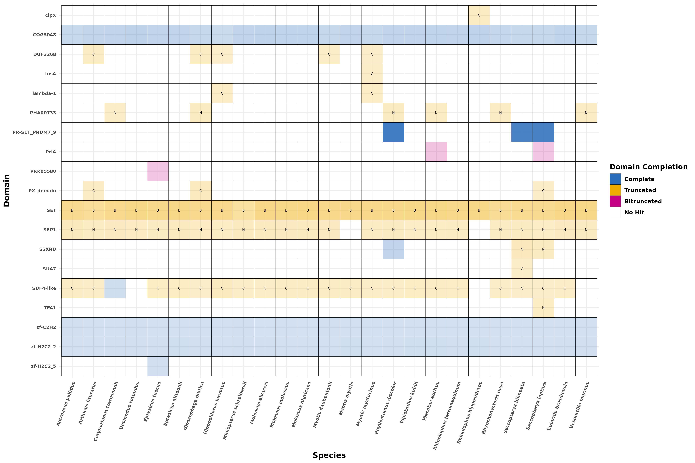
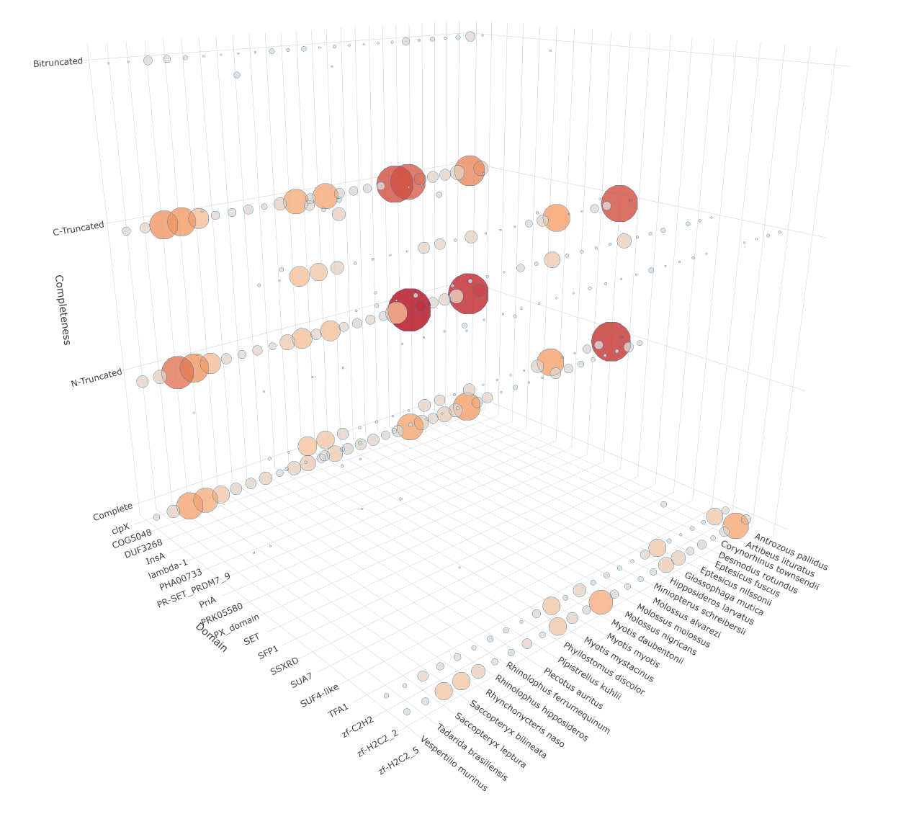

[](https://github.com/JorgeAndOmics?tab=repositories)
[](https://www.linkedin.com/in/jorge-gonzalez-garcia/)


[](images/logo.png)


# rpsHunter


**rpsHunter** is a production-grade bioinformatics pipeline for detecting, quantifying, and classifying protein domains in genomic sequences. It combines homology-based searches (tBLASTn) with specialized domain detection (RPSBLAST against NCBI CDD) and HMM-based filtering (HMMER against Pfam) to identify conserved protein domains across multiple genomes.

Built on Snakemake, rpsHunter provides fully parallelized, reproducible, and fault-tolerant execution from genome acquisition through publication-quality visualization.

## Key Features

- **Two-database domain detection** combining NCBI CDD (RPSBLAST) and Pfam (HMMER) for sensitive and specific identification
- **Multi-gate filtering** with configurable BLAST quality, ORF detection, and HMMER thresholds --- each independently toggleable
- **CDD subset searching** to target specific domain families instead of the full database
- **HMMER profile isolation** to search only user-specified Pfam domains
- **Multi-domain capture** retaining all quality-passing HMMER hits per sequence, not just the best
- **Snakemake-orchestrated parallelism** with per-species wildcard rules and automatic dependency resolution
- **Comprehensive audit trail** with per-sequence pass/fail flags at every filtering gate
- **Dual output formats** (Parquet + CSV) for all tables, GFF3 for genomic coordinates
- **Publication-quality visualizations** including domain completeness heatmaps and interactive 3D scatter plots
- **Cross-platform support** for Linux, macOS, and Windows (WSL)

## Quick Start

```bash
# 1. Clone the repository
git clone https://github.com/JorgeAndOmics/rpsHunter.git
cd rpsHunter

# 2. Create the conda environment
conda env create -f data/config/environment.yaml

# 3. Configure your analysis
#    Edit data/config/config.yaml with your species, query protein, and thresholds

# 4. Download databases (one-time setup)
conda run -n rpsHunter ./rpsHunter --setup-databases --skip-validation

# 5. Run the pipeline (each stage separately)
conda run -n rpsHunter ./rpsHunter --download-genomes --skip-validation
conda run -n rpsHunter ./rpsHunter --download-query --skip-validation
conda run -n rpsHunter ./rpsHunter --blast-dbs --skip-validation
conda run -n rpsHunter ./rpsHunter --blast --skip-validation
conda run -n rpsHunter ./rpsHunter --hmmer --skip-validation
conda run -n rpsHunter ./rpsHunter --rpsblast --skip-validation
conda run -n rpsHunter ./rpsHunter --rpsbproc --skip-validation
conda run -n rpsHunter ./rpsHunter --rpsbproc-parser --skip-validation
conda run -n rpsHunter ./rpsHunter --completeness-detector --skip-validation
conda run -n rpsHunter ./rpsHunter --contingency-parser --skip-validation
```

> **Important:** Each CLI flag dispatches a separate Snakemake subprocess. Run one flag per invocation. See the [CLI Reference](docs/cli-reference.md) for details.

## Installation

### Prerequisites

- [Miniconda](https://docs.conda.io/en/latest/miniconda.html) or [Mamba](https://mamba.readthedocs.io/) (recommended)
- Git

### Setup

1. **Clone the repository:**

   ```bash
   git clone https://github.com/JorgeAndOmics/rpsHunter.git
   cd rpsHunter
   ```

2. **Create the conda environment** from the provided specification:

   ```bash
   conda env create -f data/config/environment.yaml
   ```

   This installs all dependencies including Python 3.12, R 4.x, BLAST+, HMMER, Snakemake, rpsbproc, and all required R/Python packages.

3. **Download required databases** (CDD, rpsbproc annotation data, CDD SMP files):

   ```bash
   conda run -n rpsHunter ./rpsHunter --setup-databases --skip-validation
   ```

4. **Download the Pfam HMM database** (required if using HMMER filtering):

   The Pfam database is downloaded automatically when HMMER rules are first invoked. No manual setup is needed.

5. **Configure your analysis** by editing `data/config/config.yaml`:
   - Set `query.accession` to your protein of interest
   - Define your species in the `species:` dictionary
   - Set `root.db_root_folder` to where databases should be stored
   - Adjust thresholds as needed (see [Configuration Reference](docs/configuration.md))

6. **Prepare rpsbproc annotation data:**

   After running `--setup-databases`, the rpsbproc annotation files are placed in `db_root_folder/rpsbproc_dbs/`. No further manual configuration is needed.

## Usage

rpsHunter is executed from the project root directory. Each pipeline stage is invoked with its own CLI flag:

```bash
# Run BLAST searches and generate filtered FASTAs + aggregate table
conda run -n rpsHunter ./rpsHunter --blast --skip-validation

# Run HMMER domain filtering
conda run -n rpsHunter ./rpsHunter --hmmer --skip-validation

# Run RPSBLAST domain detection
conda run -n rpsHunter ./rpsHunter --rpsblast --skip-validation

# Generate domain completeness heatmap
conda run -n rpsHunter ./rpsHunter --completeness-detector --skip-validation
```

For the complete flag reference and workflow recipes, see the [CLI Reference](docs/cli-reference.md).

## Documentation

| Document | Description |
|----------|-------------|
| [Architecture](docs/architecture.md) | Pipeline stages, data flow diagrams, parallelism model, design principles |
| [Configuration](docs/configuration.md) | Complete `config.yaml` parameter reference with types, defaults, and examples |
| [Filtering](docs/filtering.md) | BLAST quality gate, ORF gate, HMMER two-level filtering, the "riding" edge case |
| [Outputs](docs/outputs.md) | Output directory structure, parquet column schemas, file format descriptions |
| [CLI Reference](docs/cli-reference.md) | All CLI flags, invocation patterns, flag-to-rule mapping, rerun recipes |
| [Troubleshooting](docs/troubleshooting.md) | Common issues, empty species handling, Windows/WSL caveats |

## Screenshots

### Domain Completeness Heatmap

[](images/tile-plot.jpg)

### Interactive 3D Domain Scatter Plot

[](images/3D-plot.png)

## Environment Variables

To enhance performance when downloading data from NCBI, you may optionally provide an NCBI API key. This significantly increases the request rate limit for NCBI services. Instructions for obtaining an API key can be found in the [NCBI documentation](https://support.nlm.nih.gov/kbArticle/?pn=KA-05317).

When launching the pipeline, rpsHunter will prompt you to enter your API key unless input validation is explicitly skipped using `--skip-validation` or `-skp`. Your API key is sensitive and should not be shared.

Additionally, a valid email address must be provided under the `entrez_email` field in `config.yaml`. This is required by NCBI's Entrez API for responsible use.

## Acknowledgments

[](images/TCD.png)

- Ni Leathlobhair lab @ Moyne

## Contributing

Contributions are always welcome! Feel free to generate a pull request, or contact me at jgonzlez@tcd.ie for any questions.

## License

[MIT](https://choosealicense.com/licenses/mit/)

## References

Camacho, C., Coulouris, G., Avagyan, V., Ma, N., Papadopoulos, J., Bealer, K., & Madden, T. L. (2009). BLAST+: Architecture and applications. *BMC Bioinformatics, 10*, 421. https://doi.org/10.1186/1471-2105-10-421

Sayers, E. W., Bolton, E. E., Brister, J. R., Canese, K., Chan, J., Comeau, D. C., ... & Ostell, J. (2022). Database resources of the National Center for Biotechnology Information. *Nucleic Acids Research, 50*(D1), D20-D26. https://doi.org/10.1093/nar/gkab1112
(*Reference for NCBI Datasets and API services*)

Eddy, S. R. (2011). Accelerated profile HMM searches. *PLoS Computational Biology, 7*(10), e1002195. https://doi.org/10.1371/journal.pcbi.1002195
(*Reference for HMMER*)

Mistry, J., Chuguransky, S., Williams, L., Qureshi, M., Salazar, G. A., Sonnhammer, E. L., ... & Bateman, A. (2021). Pfam: The protein families database in 2021. *Nucleic Acids Research, 49*(D1), D412-D419. https://doi.org/10.1093/nar/gkaa913
(*Reference for the Pfam database*)

Molder, F., Jablonski, K. P., Letcher, B., Hall, M. B., Tomkins-Tinch, C. H., Sochat, V., ... & Koster, J. (2021). Sustainable data analysis with Snakemake. *F1000Research, 10*, 33. https://doi.org/10.12688/f1000research.29032.2
(*Reference for the Snakemake workflow management system*)
