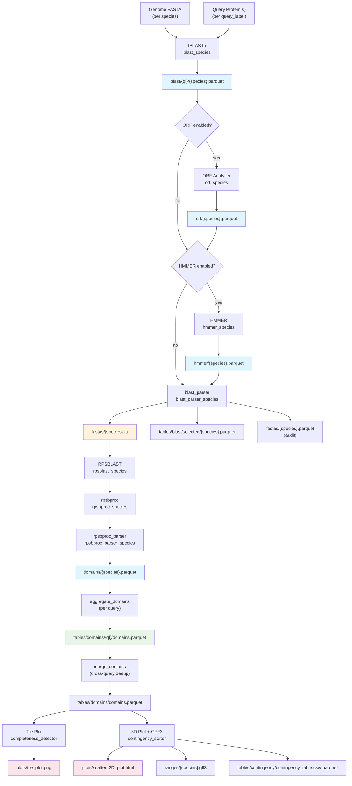
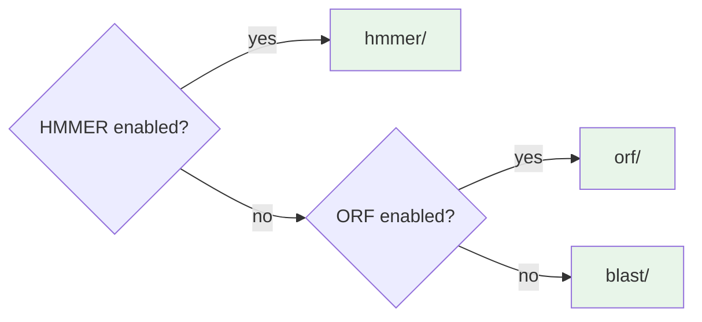
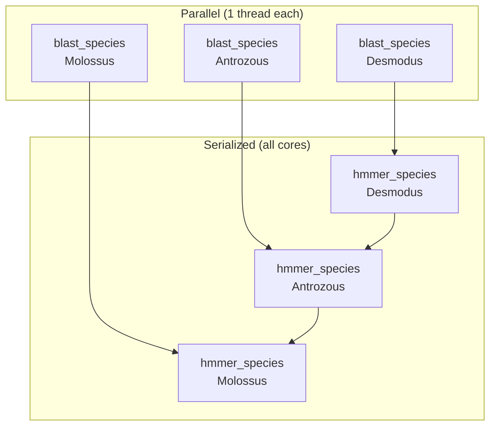

# Architecture

## Overview

rpsHunter is a multi-stage bioinformatics pipeline that detects, quantifies, and classifies protein domains in genomic sequences. It uses a **two-database approach**:

1. **tBLASTn** searches a query protein against genome nucleotide databases to find homologous regions
2. **RPSBLAST** searches those regions against the NCBI Conserved Domain Database (CDD) to annotate protein domains

Between these two searches, optional enrichment stages (ORF detection, HMMER filtering) refine the hit set. The pipeline processes multiple species in parallel using Snakemake's wildcard system.

The pipeline supports **multi-query mode**: multiple query proteins can be searched independently (each running the full pipeline), with domain-level deduplication of the merged results via GenomicRanges. This is controlled by the `queries:` config key.

## Pipeline Data Flow



## Pipeline Stages

### Stage 1: Data Acquisition

| Rule | CLI Flag | Description |
|------|----------|-------------|
| `genome_downloader` | `--download-genomes` | Fetch reference genomes from NCBI Datasets |
| `query_downloader` | `--download-query` | Download query protein sequence from NCBI |
| `setup_databases` | `--setup-databases` | Download CDD, rpsbproc annotation data, and CDD SMP files |

### Stage 2: Database Preparation

| Rule | CLI Flag | Description |
|------|----------|-------------|
| `blast_db_generator` | `--blast-dbs` | Generate BLAST nucleotide databases (one per species) |
| `cdd_subset_builder` | (automatic) | Build CDD subset database from `target_domains` if configured |
| `hmmer_extract_profiles` | (automatic) | Extract Pfam subset HMM from `profiles` if configured |

### Stage 3: Homology Search

| Rule | CLI Flag | Description |
|------|----------|-------------|
| `blast_species` | (pulled by `--blast`) | Run tBLASTn: query protein vs genome database (per species) |

### Stage 4: Enrichment (conditional)

| Rule | CLI Flag | Condition | Description |
|------|----------|-----------|-------------|
| `orf_species` | `--orf-analyser` | `orf.enabled: true` | Detect ORFs in BLAST hit sequences, add `ORF_Filtered` column |
| `hmmer_species` | `--hmmer` | `hmmer.enabled: true` | Run hmmsearch against Pfam, add `HMM_*` columns |

### Stage 5: Filtering & Export

| Rule | CLI Flag | Description |
|------|----------|-------------|
| `blast_parser_species` | `--blast` | Apply 3-gate filter chain (Quality + ORF + HMMER), export FASTA |
| `aggregate_blast` | `--blast` | Concatenate enriched per-species parquets into per-query `tables/blast/{ql}/aggregate.parquet` |
| `merge_blast` | `--blast` | Merge per-query BLAST aggregates into `tables/blast/aggregate.parquet` |

### Stage 6: Domain Detection

| Rule | CLI Flag | Description |
|------|----------|-------------|
| `rpsblast_species` | `--rpsblast` | Search filtered sequences against CDD (or CDD subset) |
| `aggregate_rpsblast` | `--rpsblast` | Concatenate per-species RPSBLAST parquets into per-query `tables/rpsblast/{ql}/rpsblast.parquet` |
| `merge_rpsblast` | `--rpsblast` | Merge per-query RPSBLAST aggregates into `tables/rpsblast/rpsblast.parquet` |
| `rpsbproc_species` | `--rpsbproc` | Post-process RPSBLAST ASN output with rpsbproc |
| `rpsbproc_parser_species` | `--rpsbproc-parser` | Parse rpsbproc text output into structured domain parquets |
| `aggregate_domains` | `--rpsbproc-parser` | Concatenate per-species domain parquets into per-query `tables/domains/{ql}/domains.parquet` |
| `merge_domains` | `--rpsbproc-parser` | Merge per-query domain tables with GenomicRanges deduplication into `tables/domains/domains.parquet` |

### Stage 7: Hit–Domain Inventory

| Rule | CLI Flag | Description |
|------|----------|-------------|
| `pq_hit_domain_inventory` | `--hit-domain-inventory` | Join BLAST hits with CDD domains via Tag; flag completeness against `hmmer.profiles` |
| `merge_hit_domain_inventory` | `--hit-domain-inventory` | Concatenate per-query inventories into merged table |

### Stage 8: Visualization & Aggregation

Both visualization rules also trigger all three aggregation rules (`aggregate_blast`, `aggregate_rpsblast`, `aggregate_domains`) as inputs, ensuring all aggregate tables are generated when running the terminal pipeline stages.

| Rule | CLI Flag | Description |
|------|----------|-------------|
| `completeness_detector` | `--completeness-detector` | Generate tile plot (domain completeness heatmap) |
| `contingency_sorter` | `--contingency-parser` | Generate 3D scatter plot, contingency table, GFF3 files |

### Stage 9: Concordance & Extended Plots

| Rule | CLI Flag | Description |
|------|----------|-------------|
| `pq_concordance` | `--concordance` | Per-query HMMER vs CDD concordance analysis |
| `merge_concordance` | `--concordance` | Merge per-query concordance tables |
| `extended_plots` | `--extended-plots` | Generate 7 analytical plots from merged domain and concordance data |

## ENRICHED_BLAST_DIR Resolution

The pipeline supports optional enrichment steps (ORF, HMMER) between the initial BLAST search and the blast_parser filtering. The `ENRICHED_BLAST_DIR` constant determines which directory blast_parser reads from, resolved once at Snakefile parse time:



**Resolution logic** (from `workflow/Snakefile`):

```
ENRICHED_BLAST_DIR =
    hmmer/     if hmmer.enabled
    orf/       if orf.enabled (and hmmer not enabled)
    blast/     otherwise
```

This means blast_parser always reads the output of the **last enabled enrichment step**, regardless of which combination of ORF/HMMER is active. The enrichment steps chain: `blast/ -> orf/ -> hmmer/`, each reading from the previous step's output.

Similarly, `PRE_HMMER_DIR` resolves the input for the HMMER step:

```
PRE_HMMER_DIR =
    orf/       if orf.enabled
    blast/     otherwise
```

## Parallelism Model

rpsHunter uses Snakemake's wildcard system for parallelism. Every per-species rule uses dual `{query_label}` x `{species}` wildcards, allowing Snakemake to schedule them as independent jobs. With Q queries and N species, most rules produce Q x N jobs.



### Thread Allocation

| Rule Pattern | Threads | Reason |
|-------------|---------|--------|
| `blast_species` | 1 | tBLASTn uses its own internal threading; one Snakemake job per species allows 3 concurrent jobs |
| `orf_species` | 1 | R script, single-threaded |
| `hmmer_species` | `workflow.cores` (all) | hmmsearch is CPU-intensive; serialized to prevent over-subscription |
| `blast_parser_species` | 1 | Python filtering, I/O bound |
| `rpsblast_species` | 1 | One job per species, runs in parallel |
| `rpsbproc_species` | 1 | One job per species, runs in parallel |
| `rpsbproc_parser_species` | 1 | Parsing, I/O bound |

The key insight: most rules use `threads: 1`, which lets Snakemake run up to `num_cores` species jobs simultaneously. HMMER is the exception --- it claims all cores (`threads: workflow.cores`), which forces Snakemake to serialize HMMER jobs (one species at a time, but using all 16 cores for hmmsearch).

## Tag System

Every BLAST hit receives a 6-character random alphanumeric ID (the **Tag**) at creation time in `blast.py`. This Tag propagates through the entire pipeline:

1. **blast.py** --- generates `Tag` column with `random_string_generator()`
2. **blast_parser.py** --- embeds Tag in FASTA header: `{Subject_ID}:{S.Start}-{S.End}|tag:{Tag}`
3. **rpsblast.py** --- extracts Tag from FASTA header back into a column
4. **rpsbproc_parser.py** --- extracts Tag from the `Definition` field via regex `\|tag:(\w+)`

This allows joining domain annotations back to their source BLAST hits across the entire pipeline.

## Design Principles

rpsHunter is built on four core principles:

### 1. Reproducibility

- All parameters in version-controlled `config.yaml` with schema validation (Yamale)
- Conda environment specification pins all dependency versions
- HMMER `seed` parameter ensures deterministic stochastic tracebacks
- Snakemake tracks input/output file checksums for automatic invalidation

### 2. Modularity

- Each pipeline stage is an independent script with CLI arguments
- Scripts can be run standalone outside Snakemake
- Enrichment steps (ORF, HMMER) are independently toggleable via config
- CDD subset and HMMER profile isolation are additive features

### 3. Parallelism

- Snakemake DAG-level parallelism via `{species}` wildcards
- Per-species rules run concurrently (up to `num_cores` jobs)
- HMMER correctly serialized to prevent CPU over-subscription
- No internal ThreadPoolExecutor --- Snakemake handles all scheduling

### 4. Efficiency

- Apache Parquet for all intermediate data (columnar, compressed, type-safe)
- Per-species intermediate files avoid reprocessing unaffected species
- CDD subset and HMMER profile extraction search smaller databases
- Empty-species path handles 0-hit cases without pipeline failures

## Script Inventory

| Script | Stage | Description |
|--------|-------|-------------|
| `rpsHunter.py` | CLI | Main CLI dispatcher, maps flags to Snakemake rules |
| `blast.py` | Homology Search | Runs tBLASTn for a single species, writes parquet + ASN |
| `blast_parser.py` | Filtering | 3-gate filter chain + FASTA export + audit trail |
| `orf_analyser.R` | Enrichment | ORF detection using ORFik/Biostrings, enriches blast parquet |
| `hmmer.py` | Enrichment | hmmsearch + quality filter, enriches blast parquet with HMM_* columns |
| `rpsblast.py` | Domain Detection | Runs RPSBLAST against CDD for a single species |
| `rpsbproc.py` | Domain Detection | Runs rpsbproc on RPSBLAST ASN output |
| `rpsbproc_parser.py` | Domain Detection | Parses rpsbproc text output into structured domain parquet |
| `aggregate.py` | Aggregation | Concatenates per-species parquets into combined tables |
| `merge_queries.R` | Merge | Cross-query domain deduplication via GenomicRanges range reduction |
| `hit_domain_inventory.py` | Analysis | Join BLAST hits with CDD domains via Tag; completeness flagging |
| `concordance.py` | Analysis | Multi-method concordance analysis (HMMER vs CDD domain agreement) |
| `cdd_subset.py` | Database Prep | Builds CDD subset database from target domain SMP files |
| `completeness_detector.R` | Visualization | Generates domain completeness tile plot |
| `contingency_sorter.R` | Visualization | Generates 3D scatter plot, contingency table, GFF3 files |
| `extended_plots.R` | Visualization | Generates extended visualization suite (7 analytical plots) from merged outputs |
| `defaults.py` | Configuration | Loads config.yaml, defines all path constants and thresholds |
| `validator.py` | Validation | Pre-run validation of dependencies, files, and config |
| `colored_logging.py` | Utility | Configurable colored console + file logging |
