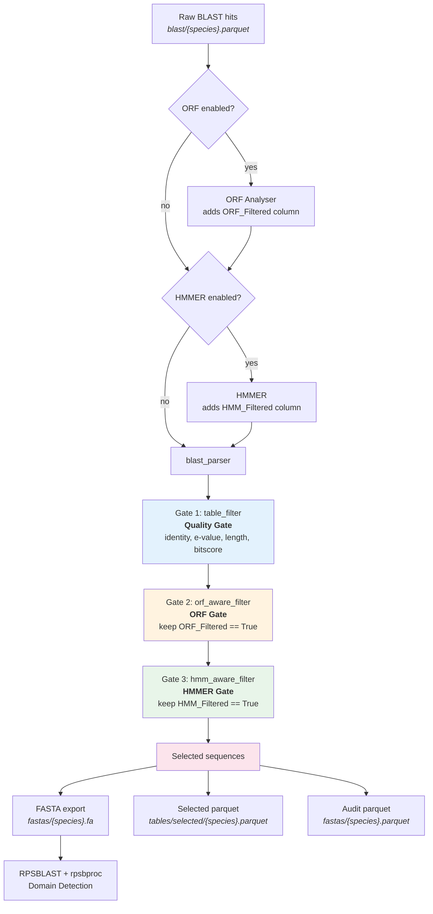

# Filtering Logic

This document describes the multi-stage filtering system that refines raw BLAST hits into a curated set of sequences for domain detection. For pipeline architecture and data flow, see [architecture.md](architecture.md). For threshold parameters, see [configuration](../data/config/config.yaml).

---

## Filter Chain Overview

Every BLAST hit passes through a sequential chain of gates before reaching RPSBLAST domain detection. Each gate is independently toggleable: if the upstream enrichment step was disabled, the corresponding gate is transparently skipped.



The filter chain in `blast_parser.py` runs strictly in order:

```
table_filter --> orf_aware_filter --> hmm_aware_filter --> FASTA export
```

An empty result at any stage is a valid outcome --- the pipeline writes an empty FASTA and continues without error.

---

## Gate 1: BLAST Quality Gate

**Script:** `blast_parser.py` -- `table_filter()`

The quality gate applies hard thresholds on four BLAST alignment metrics. A hit must pass **all four** simultaneously (boolean AND).

| Metric | Column | Operator | Config Key | Default |
|--------|--------|----------|------------|---------|
| Percent identity | `Pct Identity` | `>=` | `blast.perc_identity` | 60 |
| E-value | `E-value` | `<=` | `blast.e_value` | 0.01 |
| Alignment length | `Alignment Length` | `>=` | `blast.seq_length` | 50 |
| Bit score | `Bit Score` | `>=` | `blast.bitscore` | 70 |

```python
def table_filter(df):
    return df[
        (df['Pct Identity']      >= defaults.PERC_IDENTITY_THRESHOLD) &
        (df['E-value']           <= defaults.E_VALUE_THRESHOLD) &
        (df['Alignment Length']  >= defaults.SEQ_LENGTH_THRESHOLD) &
        (df['Bit Score']         >= defaults.BITSCORE_THRESHOLD)
    ].copy()
```

### Threshold Selection

The default thresholds (60% identity, e-value 0.01, 50 aa, bitscore 70) are conservative and suited for detecting well-conserved orthologs. For divergent domain searches (e.g., KRAB, SET, SSXRD in bat genomes), relaxed thresholds may be necessary:

| Scenario | identity | seq_length | bitscore | e_value |
|----------|----------|------------|----------|---------|
| Conservative (default) | 60 | 50 | 70 | 0.01 |
| Relaxed (divergent domains) | 35 | 24 | 45 | 0.01 |

Short domains like SSXRD may produce alignments as short as 24 amino acids. If `seq_length` is set above this, they are silently dropped at this gate.

---

## Gate 2: ORF Gate

**Script:** `blast_parser.py` -- `orf_aware_filter()`

The ORF gate filters sequences based on whether they contain an open reading frame of sufficient length. The `ORF_Filtered` column is set upstream by `orf_analyser.R`, which uses ORFik/Biostrings to detect ORFs in each BLAST hit sequence.

| Parameter | Config Key | Default | Description |
|-----------|------------|---------|-------------|
| Minimum ORF length | `orf.min_orf_length` | 200 nt | Minimum nucleotide length of detected ORF |
| Start codon | `orf.start_codon` | `''` (any) | Restrict to specific start codon |
| Longest ORF only | `orf.longest_orf` | `true` | Keep only the longest ORF per reading frame |
| Enabled | `orf.enabled` | `true` | Toggle the entire ORF step on/off |

### Gate Contract

```python
def orf_aware_filter(df):
    if 'ORF_Filtered' not in df.columns:
        return df                                    # ORF disabled -- pass through
    return df[df['ORF_Filtered'] == True].copy()     # Keep only True rows
```

- **Column missing** (ORF step disabled): all rows pass through unchanged.
- **Column present, some True**: only True rows survive.
- **Column present, zero True**: returns empty DataFrame. This is a valid outcome.

### The Short Domain Problem

Some biologically important domains are too short to contain ORFs meeting the minimum length threshold. This was discovered during pipeline development with PRDM9-related domains in bat genomes:

| Domain | Typical alignment | ORF found at 200 nt? | ORF found at 50 nt? |
|--------|-------------------|----------------------|---------------------|
| zf-C2H2 | 60--80 aa | Sometimes | Usually |
| KRAB | 40--60 aa | Rarely | Rarely |
| SET | 80--130 aa | Sometimes | Sometimes |
| SSXRD | 20--30 aa | No | No |

**Impact:** With ORF filtering enabled at the default 200 nt threshold, KRAB and SET domains were completely absent from the final results --- they passed BLAST quality thresholds and HMMER identification but lacked ORFs of sufficient length. Only after disabling ORF filtering (`orf.enabled: false`) were these domains successfully carried through to RPSBLAST and annotated by CDD.

**Recommendation:** Disable ORF filtering when searching for short or fragmented domains. The HMMER gate provides sufficient biological validation in most cases.

---

## Gate 3: HMMER Gate

**Script:** `blast_parser.py` -- `hmm_aware_filter()`

The HMMER gate filters sequences based on whether hmmsearch identified any Pfam domain hits that passed quality thresholds. This gate operates on the `HMM_Filtered` boolean column set upstream by `hmmer.py`.

### Gate Contract

Identical to the ORF gate:

```python
def hmm_aware_filter(df):
    if 'HMM_Filtered' not in df.columns:
        return df                                    # HMMER disabled -- pass through
    return df[df['HMM_Filtered'] == True].copy()     # Keep only True rows
```

- **Column missing** (HMMER step disabled): all rows pass through.
- **Column present**: keep only rows where `HMM_Filtered == True`.

`HMM_Filtered` is a scalar boolean. It is `True` if the sequence matched **any** domain that passed both levels of HMMER filtering (see below). The specific domains are stored in the list-valued `HMM_Domain` column.

---

## HMMER Two-Level Filtering

**Script:** `hmmer.py`

HMMER filtering operates in two distinct levels: constraints applied during the hmmsearch execution itself (Level 1), and post-search quality filtering in Python (Level 2). Understanding both levels --- and the interaction between them --- is essential for interpreting results.

### Level 1: hmmsearch CLI Flags

These flags are passed directly to the `hmmsearch` command and control which hits appear in the domain table output (`--domtblout`).

| Flag | Config Key | Default | Description |
|------|------------|---------|-------------|
| `-E` | `hmmer.evalue` | 1e-5 | Sequence-level E-value threshold |
| `--domE` | `hmmer.dom_evalue` | 1e-3 | Per-domain independent E-value (i-Evalue) threshold |
| `--cut_ga` | `hmmer.use_gathering_threshold` | `false` | Use Pfam curated gathering thresholds (overrides `-E`/`--domE`) |
| `--max` | `hmmer.max_sensitivity` | `false` | Disable all heuristic filters (maximum sensitivity, slow) |
| `--nobias` | `hmmer.bias_filter` (inverted) | not set | Disable the bias composition filter |
| `--seed` | `hmmer.seed` | 67 | Random number seed for reproducibility |

**Threshold strategy:** When `use_gathering_threshold` is `false`, manual `-E` and `--domE` values are used. When `true`, Pfam's curated `--cut_ga` thresholds override both, providing domain-family-specific cutoffs.

### Level 2: Post-Search Quality Filter

After hmmsearch completes, `quality_filter()` applies additional criteria to each individual domain hit in the parsed domain table:

| Metric | Computation | Config Key | Default |
|--------|-------------|------------|---------|
| Coverage | `(cov_to - cov_from + 1) / cov_len` | `hmmer.min_coverage` | 0.5 |
| Alignment length | `to - from + 1` | `hmmer.min_alignment_length` | 20 aa |

```python
def quality_filter(hits):
    hits['coverage'] = (hits['cov_to'] - hits['cov_from'] + 1) / hits['cov_len']
    hits['aln_len'] = hits['to'] - hits['from'] + 1
    return hits[
        (hits['coverage'] >= defaults.HMMER_MIN_COVERAGE) &
        (hits['aln_len'] >= defaults.HMMER_MIN_ALN_LEN)
    ]
```

- **Coverage** measures what fraction of the HMM model (profile length) is covered by the alignment. A coverage of 0.5 means at least half the model must be matched.
- **Alignment length** is the span of the alignment on the target sequence in amino acids.

### The "Riding" Edge Case

hmmsearch evaluates sequences in two phases:

1. **Sequence-level scoring.** The `-E` threshold is applied to the *entire sequence*. The sequence-level score is the **cumulative score of all domain hits** on that sequence.
2. **Domain-level scoring.** The `--domE` threshold is applied to each *individual domain hit* (the i-Evalue, or independent E-value).

This creates an important edge case: a sequence with many weak domain hits can accumulate a strong sequence-level score. Individual domain hits that would not pass the `--domE` threshold on their own may still appear in the `--domtblout` output because the **sequence** passed the `-E` threshold first. These weak hits "ride in" on the strength of the aggregate sequence score.

```
Example: Sequence with 12 zf-C2H2 tandem repeats

  Sequence-level:  E-value = 1.2e-45  (cumulative, easily passes -E 1e-5)
  Domain hit  1:   i-Evalue = 3.1e-12  (strong, passes --domE 1e-3)
  Domain hit  2:   i-Evalue = 8.7e-09  (strong, passes)
  ...
  Domain hit 11:   i-Evalue = 2.4e-04  (moderate, passes)
  Domain hit 12:   i-Evalue = 7.8e-01  (weak, FAILS --domE 1e-3)
```

In practice, hmmsearch may still report domain hit 12 in the domtblout because the sequence passed the `-E` gate. The Level 2 `quality_filter()` then independently evaluates each domain hit's coverage and alignment length. A weak hit that "rode in" may:

- **Pass Level 2** if it covers enough of the HMM model and has sufficient alignment length --- it is retained as a legitimate partial match.
- **Fail Level 2** if its coverage or alignment length is too low --- it is discarded.

This is by design. The two-level system provides defense in depth: Level 1 controls what enters the domain table, Level 2 ensures each individual hit meets quality standards regardless of how it entered.

### Multi-Domain Capture

All domain hits that pass both filtering levels are retained per sequence. The enrichment columns are:

| Column | Type | Description |
|--------|------|-------------|
| `HMM_Filtered` | `bool` (scalar) | `True` if sequence has any quality-passing domain hit |
| `HMM_Domain` | `list[str]` | Pfam domain names, sorted by E-value ascending |
| `HMM_Evalue` | `list[float]` | Per-domain E-values, sorted ascending (best first) |
| `HMM_Score` | `list[float]` | Per-domain bit scores |
| `HMM_Coverage` | `list[float]` | Fraction of HMM model covered per hit |

A sequence matching 12 zf-C2H2 domains stores all 12 in these list columns. Previously, only the single best hit (lowest E-value) was retained; this was changed to capture the full multi-domain architecture of tandem repeat proteins like zinc finger arrays.

**Implication for HMM_Filtered:** The boolean remains scalar. A sequence is `True` if *any* domain hit passed quality filters. The blast_parser HMMER gate operates solely on this boolean --- it does not inspect individual domain hits. Domain-level analysis happens downstream in RPSBLAST/CDD.

---

## blast_parser Gate Logic

**Script:** `blast_parser.py`

All three gates follow the same strict contract:

| Condition | Behavior |
|-----------|----------|
| Filter column **missing** | Step was disabled in config --- pass all rows through unchanged |
| Filter column **present**, some rows `True` | Keep only `True` rows |
| Filter column **present**, zero rows `True` | Return empty DataFrame (valid outcome) |

This contract means:
- **No fallback.** If an enrichment step ran but produced zero passing hits for a species, the result is zero sequences in the FASTA. There is no "fall back to unfiltered" behavior.
- **Transparent bypass.** Disabling a step in config means the column is never added, so the gate transparently passes all rows. No code changes are needed.
- **Order matters.** Gates run in fixed order (Quality, ORF, HMMER). A row must pass all active gates to be selected.

---

## Audit Trail

**Script:** `blast_parser.py`

Before any filtering occurs, blast_parser computes audit flags on every input row and writes them to `fastas/{species}.parquet`. This audit parquet contains the full unfiltered dataset plus four diagnostic columns:

| Column | Type | Meaning |
|--------|------|---------|
| `Quality_Pass` | `bool` | Row passes all four BLAST quality thresholds |
| `ORF_Pass` | `bool` or `NaN` | `True`/`False` if ORF step ran; `NaN` (nullable boolean) if ORF was disabled |
| `HMM_Pass` | `bool` or `NaN` | `True`/`False` if HMMER step ran; `NaN` (nullable boolean) if HMMER was disabled |
| `Selected` | `bool` | `True` only for rows that survived all active gates and were exported to FASTA |

### Usage

The audit parquet enables post-hoc analysis of the filtering funnel without re-running the pipeline:

```python
import pandas as pd

audit = pd.read_parquet('results/fastas/Desmodus_rotundus.parquet')

# How many passed each gate?
print(audit['Quality_Pass'].sum())    # e.g., 6886
print(audit['ORF_Pass'].sum())        # e.g., 3039 (or NaN count if ORF disabled)
print(audit['HMM_Pass'].sum())        # e.g., 5073
print(audit['Selected'].sum())        # e.g., 93

# Which rows failed only the ORF gate?
orf_blocked = audit[
    audit['Quality_Pass'] & ~audit['ORF_Pass'] & audit['HMM_Pass']
]
```

The `Selected` column marks the intersection of all active gates. Its sum equals the number of sequences in the corresponding FASTA file.

---

## Filtering Funnel Examples

Real numbers from pipeline runs on 3 bat species (Desmodus rotundus, Antrozous pallidus, Molossus molossus) with query protein NP_064612.2 (PRDM9).

### With ORF + HMMER Enabled

Config: `orf.enabled: true`, `orf.min_orf_length: 50`, `hmmer.enabled: true`, BLAST thresholds relaxed (identity 35%, length 24 aa, bitscore 45).

```
23,245 BLAST hits
   |
   v  table_filter (Quality Gate)
~10,196 pass ORF (44% of BLAST hits contain ORFs >= 50 nt)
   |
   v  hmm_aware_filter
~17,215 pass HMMER
   |
   v  intersection of Quality + ORF + HMMER
  250 selected (1.1% of raw BLAST hits)
   |
   v  RPSBLAST + rpsbproc
  311 domain annotations
```

The ORF gate is the primary bottleneck, retaining only 44% of BLAST hits. The combined ORF + HMMER requirement is highly selective at 1.1%.

### Without ORF, HMMER Enabled

Config: `orf.enabled: false`, `hmmer.enabled: true`, same BLAST thresholds.

```
23,245 BLAST hits
   |
   v  table_filter (Quality Gate)
   |  (ORF gate: column absent, pass through)
   |
   v  hmm_aware_filter
~15,316 selected (65.9% of raw BLAST hits)
   |
   v  RPSBLAST + rpsbproc
51,650 domain annotations
```

Removing the ORF gate increases selected sequences by 61x (250 to 15,316) and domain annotations by 166x (311 to 51,650). This dramatic difference reflects the biological reality that many genuine domain-containing sequences lack long ORFs --- particularly fragmented genomic hits and short domains like KRAB and SET.

### Comparison

| Metric | ORF + HMMER | HMMER only | Ratio |
|--------|-------------|------------|-------|
| BLAST hits | 23,245 | 23,245 | 1.0x |
| Selected sequences | 250 | 15,316 | 61x |
| Domain annotations | 311 | 51,650 | 166x |
| KRAB domains found | 0 | 12 | -- |
| SET domains found | 0 | 3 | -- |
| SSXRD domains found | 0 | 1 | -- |

The ORF filter was the sole barrier preventing KRAB, SET, and SSXRD detection. These domains passed BLAST quality thresholds and HMMER identification but lacked ORFs of sufficient length to pass the ORF gate.

---

## Cross-Query Domain Deduplication

When using multi-query mode (`queries:` config key with multiple accessions), each query runs the full filtering pipeline independently. After all per-query pipelines complete, the `merge_domains` rule deduplicates overlapping domain annotations using GenomicRanges:

1. **Group** domain annotations by Species x Chromosome x Domain
2. **Reduce** overlapping `[Start, End]` intervals using `GenomicRanges::reduce(with.revmap=TRUE)`
3. **Collapse** metadata from contributing rows:
   - Bitscore: `max()`, Evalue: `min()` (best evidence)
   - Hit_type: priority order Specific > Non-specific > Superfamily
   - Incomplete: priority order `-` > `C`/`N` > `NC` (if any hit was complete, merged region is complete)
   - Query_Accession, Tag: comma-separated unique values (provenance tracking)

This ensures that the same genomic region annotated by different queries produces a single merged domain annotation with the best available evidence. The `Query_Accession` column in the merged output records all contributing queries.
